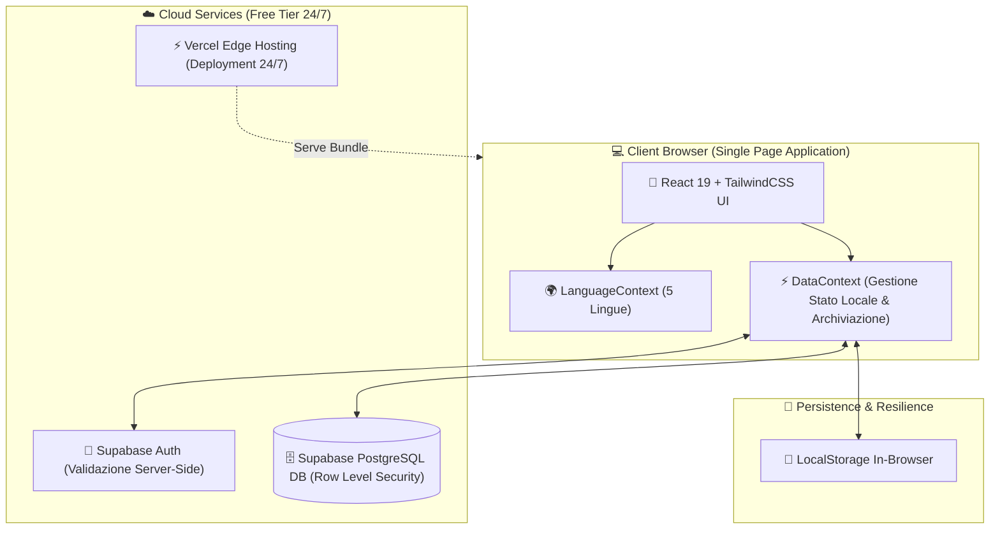

# 🏔️ Val di Scalve — Portale Turistico & Eventi

Un'applicazione web moderna, reattiva e multilingua progettata per la promozione turistica, la valorizzazione del patrimonio naturale e la gestione degli eventi dei **4 Comuni della Val di Scalve**: **Schilpario**, **Vilminore di Scalve**, **Colere** e **Azzone**.

---

## 🌟 Caratteristiche Principali

- 🏞️ **Esplorazione Luoghi & Punti d'Interesse:** Schede dettagliate per escursioni trekking, siti storici (Miniere, Diga del Gleno), natura e borghi locali.
- 📅 **Calendario Eventi & Archiviazione Automatica:** Gli eventi vengono suddivisi in tempo reale tra *In Programma* ed *Eventi Passati* in base alla data corrente.
- 🌍 **Supporto Reattivo nelle 5 Lingue ufficiali:** Italiano (🇮🇹), Inglese (🇬🇧), Tedesco (🇩🇪), Francese (🇫🇷) e Spagnolo (🇪🇸) con sistema di *Graceful Fallback* automatico.
- 🔗 **Link Esterni Personalizzati:** Pulsanti dedicati con apertura in nuova scheda (`target="_blank" rel="noopener noreferrer"`) per siti ufficiali, biglietterie ed iscrizioni a gare.
- 🔐 **Pannello di Amministrazione Riservato (`/admin`):** Gestione CRUD completa (creazione, modifica, eliminazione) di luoghi ed eventi con protezione tramite **Autenticazione Backend Supabase Auth**.
- 📷 **Caricamento Immagini da Dispositivo:** Caricamento di locandine e foto direttamente dallo smartphone/PC con anteprima immediata e supporto URL web.
- 🗺️ **Integrazione Mappe & Calendario:** Navigazione GPS immediata verso i punti d'interesse e pulsante *"Aggiungi a Google Calendar"*.
- ☁️ **Architettura 100% Zero Costi:** Progettato per operare a costo zero su Vercel (Hosting CDN 24/7) e Supabase (Database PostgreSQL Cloud).

---

## 🏗️ Architettura Tecnica di Alto Livello

L'applicazione segue un'architettura **Single Page Application (SPA)** client-heavy con sincronizzazione cloud trasparente e strategie di resilienza locale.



### 🔄 Flusso dei Dati & Resilience Strategy

1. **Primo Caricamento (Hybrid Data Fetching):**  
   All'avvio, il portale verifica se il Database Cloud Supabase è configurato ed attivo:
   - **Se il Cloud è attivo:** scarica i dati sincronizzati da Supabase PostgreSQL.
   - **Se il Cloud è vuoto o offline:** attiva il *Graceful Fallback* ricaricando in memoria i dati della Val di Scalve salvati in locale.
2. **Sicurezza & Autenticazione Backend (Supabase Auth & RLS):**  
   L'accesso all'area amministrativa viene convalidato HTTPS lato server da Supabase Auth. Le tabelle PostgreSQL usano regole di **Row Level Security (RLS)** per consentire la lettura pubblica a tutti ed autorizzare le modifiche solo agli amministratori autenticati.

---

## 🛠️ Stack Tecnologico

- **Frontend Core:** React 19, Vite 6, JavaScript (ES6+).
- **Styling & Design System:** TailwindCSS v4, Glassmorphism, Responsive Mobile-First UI.
- **Iconografia:** Lucide React.
- **State Management & i18n:** React Context API + Custom i18n Dictionary.
- **Backend & Cloud Services:** Supabase JS Client (`@supabase/supabase-js`), Supabase Auth, Supabase PostgreSQL Database.
- **Hosting & CI/CD:** Vercel Continuous Deployment.

---

## ⚙️ Guida per l'Installazione ed Avvio Locale

### 1. Prerequisiti
- Node.js (v18 o superiore)
- npm oppure yarn

### 2. Installazione
Clona il repository ed installa le dipendenze:

```bash
git clone https://github.com/tuo-account/eventi-scalve.git
cd "Eventi Scalve"
npm install
```

### 3. Configurazione Variabili d'Ambiente (`.env`)
Crea un file chiamato `.env` nella radice del progetto:

```env
VITE_SUPABASE_URL=https://tuo-progetto.supabase.co
VITE_SUPABASE_ANON_KEY=sb_publishable_tua_chiave_qui
```

*(Puoi fare riferimento al file `.env.example` come modello).*

### 4. Avvio Server di Sviluppo
Per avviare il portale in locale su `http://localhost:5173`:

```bash
npm start
```

### 5. Build di Produzione
Per compilare il pacchetto di produzione:

```bash
npm run build
```

---

## 📁 Struttura del Progetto

```text
├── src/
│   ├── components/      # Componenti riutilizzabili (Carte, Modali, Navigazione)
│   ├── context/         # DataContext (Stato dati/Cloud) & LanguageContext (i18n)
│   ├── data/            # Dataset iniziale predefinito della Val di Scalve
│   ├── lib/             # Inizializzazione client Supabase
│   ├── utils/           # Helper formattazione date in italiano/europeo
│   ├── views/           # Pagine principali (Home, Luoghi, Eventi, Admin)
│   ├── App.jsx          # Controller principale e gestione viste
│   ├── index.css        # Design System Tailwind & utility alpine
│   └── main.jsx         # Entry point React
├── schema.sql           # DDL Struttura Database PostgreSQL & Politiche RLS
├── GUIDA_DEPLOYMENT.md  # Guida passo-passo per il deployment Vercel + Supabase
└── package.json         # Dipendenze e script del progetto
```

---

## 📄 Licenza & Crediti

Progettato per la promozione della **Val di Scalve**.  
Sviluppato con le migliori pratiche di accessibilità, velocità e sicurezza web.
